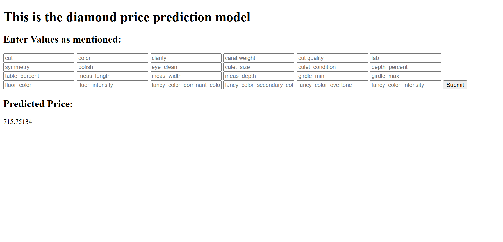

## Prediction Diamond Sale Price Using Neural Network Regression

### Problem Statement
Diamonds have various features and characteristics including cut, color, clarity, carat weight, cut quality, lab, symmetry, etc., which are measured and analyzed to determine their market price. The task is to train a machine learning model to understand the nature and relationships between these diamond features to predict the sale price of a diamond.

### Project Summary

This project utilizes a dataset containing approximately 220,000 diamond samples to train a neural network regression model for predicting diamond sale prices. 

By analyzing features such as cut, color, clarity, carat weight, cut quality, lab, symmetry and so on, the model learns the intricate relationships between these characteristics and their impact on the price. The implementation involves data preprocessing, model training, and evaluation, ultimately providing a tool to estimate diamond prices based on their features accurately. A Flask web application is used to deploy the model, allowing users to input diamond features and receive price predictions through an interactive interface.